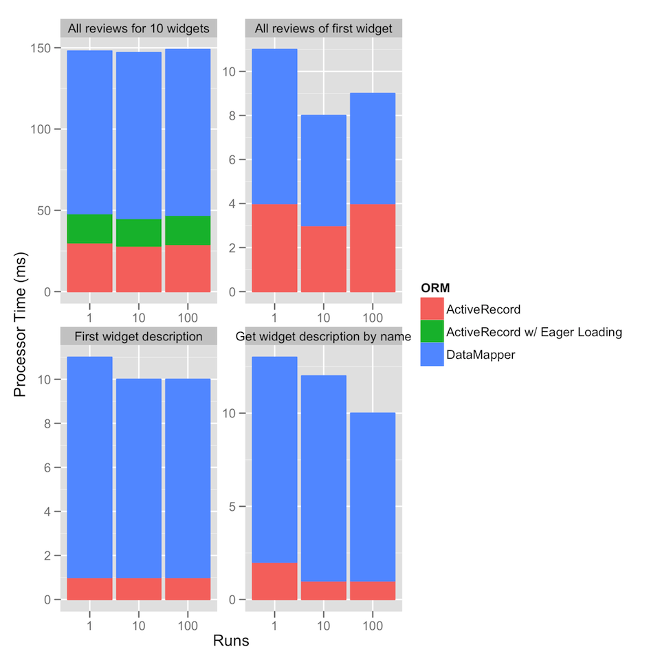

# ActiveRecord v. DataMapper Performance Comparison

I ran a few benchmarks comparing ActiveRecord and DataMapper. I tried
to construct queries that would evaluate different aspects of the ORMs,
including a simple _limit_ (`Widget.first`), a single record join, a non-
indexed lookup (`find_by_name`) and a typical n+1 scenario with and without
`includes` for ActiveRecord, which is N/A for DataMapper, as they claim to be
eager by default. The exact queries are shown after the graph.

I seeded the database using `rake db:seed` and then YAML DB to dump and load it
into the test DB. Both apps share the same DB. I ran all tests using the rails
profiler:

```bash
rails profiler --metrics wall_time,process_time,memory QUERY --runs NUM_RUNS
```



Graph generated with the [ggplot2](http://had.co.nz/ggplot2/) library for R
using the following one-liner (ha!):

```r
dat <- read.csv('results.csv')
dat$Runs <- as.factor(dat$Runs)
ggplot(dat, aes(x=Runs, y=ProcTime, color=ORM, fill=ORM))+
  geom_bar()+
  facet_wrap(~Description, scales='free')+
  labs(y='Processor Time (ms)')
```

## The queries involved

### Find widget by name

**ActiveRecord:**

```ruby
Widget.find_by_name('Widget 99').description
```

**DataMapper:**

``ruby
Widget.first(name: 'Widget 99').description
```

## All review of first widget

**ActiveRecord:**

```ruby
Widget.first.reviews.all
```

**DataMapper:**

```ruby
Widget.first.reviews.all
```

## All reviews for 10 widgets

**ActiveRecord:**

```ruby
Widget.find([218, 219, 220, 221, 222, 223, 224, 225, 226, 227]).map {|w| w.reviews }.flatten
```

**ActiveRecord w/ Eager Loading:**

```ruby
Widget.includes(:reviews).find([218, 219, 220, 221, 222, 223, 224, 225, 226, 227]).map {|w| w.reviews }.flatten
```

**DataMapper:**

```ruby
Widget.all(id: [218, 219, 220, 221, 222, 223, 224, 225, 226, 227]).map {|w| w.reviews }.flatten
```
